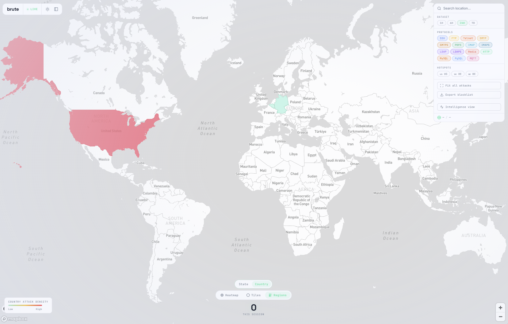

# Brute
[](https://github.com/chomnr/brute)
[](/)
[](https://github.com/chomnr/brute/releases)

Brute is a project for monitoring authentication attempts on servers using OpenSSH. It tracks and records each attempt and provides detailed information about the source of the attempt.

Currently, this project must use a specific version of OpenSSH. Unfortunately, the changes made may compromise the security of your server, so use with **caution**.

- **Straightforward** — Simply call the endpoint `/brute/attack/add`, and Brute will log, analyze, and store the credentials for you.

- **Extendable Metrics** — Brute allows developers to easily add or remove metrics as needed.

- **Location Information** — In standalone mode, information is retrieved via the [IPinfo](https://ipinfo.io/) API. In Cloudflare Workers mode, geo data is read directly from the Cloudflare `cf` request object — no external API token required.

- **WebSocket Support** — Brute supports WebSocket connections for real-time streaming. In standalone mode this uses actix-web-actors. In Workers mode this uses a hibernatable WebSocket Durable Object.

- **Dual Deployment Mode** — Run as a standalone Tokio/Actix server backed by PostgreSQL, or deploy to Cloudflare Workers with D1 (SQLite) and Analytics Engine.

<div align="center">  </div>

---

## Architecture

```
brute/
├── brute-core/       # Shared data models, validation, and trait definitions
├── brute-http/       # Standalone server (Tokio + Actix, PostgreSQL, IPinfo)
├── brute-worker/     # Cloudflare Workers (D1 + Analytics Engine + Durable Objects)
├── brute-daemon/     # Traffic source daemon (SSH, FTP)
└── migrations/
    ├── postgres/     # PostgreSQL migration files (used by brute-http)
    └── d1/           # SQLite schema files (used by brute-worker via wrangler)
```

### Crates

| Crate | Purpose |
|---|---|
| `brute-core` | Shared models (`Individual`, `ProcessedIndividual`, all `Top*` structs), validation logic, and `BruteDb` / `BruteAnalytics` / `GeoProvider` trait definitions |
| `brute-http` | Standalone HTTP server. Implements `BruteDb` via `PostgresDb` (sqlx), `GeoProvider` via `IpInfoProvider`, and `BruteAnalytics` via `PostgresAnalytics` (top_* tables) |
| `brute-worker` | Cloudflare Worker. Implements `BruteDb` via `D1Db` (workers-rs D1 binding), `GeoProvider` via `CfGeoProvider` (cf request object), and `BruteAnalytics` via `AnalyticsEngine` |

### Backend Comparison

| Feature | brute-http (standalone) | brute-worker (Cloudflare) |
|---|---|---|
| Database | PostgreSQL (sqlx) | Cloudflare D1 (SQLite) |
| Geo lookup | IPinfo.io HTTP API (token required) | Cloudflare `cf` object (free, built-in) |
| Analytics | Aggregated `top_*` tables in PostgreSQL | Cloudflare Analytics Engine data points |
| WebSocket | actix-web-actors (actor model) | Hibernatable WebSocket Durable Object |
| Deployment | Docker / systemd / bare metal | `wrangler deploy` |
| TLS | Managed via rustls + cert.pem/key.pem | Managed by Cloudflare automatically |

---

## Installation — Standalone (brute-http)

This installs `brute-http`, the standalone HTTP server that collects traffic from dummy servers.

```sh
# Download rustup
curl https://sh.rustup.rs -sSf | sh

# Add Rust to PATH (restart shell or run:)
source "$HOME/.cargo/env"

# Verify the installation
rustc -V
```

### Non-Docker

<details><summary><b>Show instructions</b></summary>

1. Clone the repository:

    ```sh
    git clone https://github.com/chomnr/brute
    ```

2. Go into the `brute-http` directory:

    ```sh
    cd brute/brute-http
    ```

3. Set the following environment variables:

    ```env
    DATABASE_URL=postgresql://postgres:{password}@{host}/{database}
    BEARER_TOKEN=xxxxxxxxxxxxxxxxxxxxxxxxxxxxxxxxxxxx
    IPINFO_TOKEN=xxxxxxxxxxxxxx
    RUST_LOG=trace
    RUST_LOG_STYLE=always
    LISTEN_ADDRESS=0.0.0.0:7000
    LISTEN_ADDRESS_TLS=0.0.0.0:7443
    RUNNING_IN_DOCKER=false
    # Optional — enables AbuseIPDB reputation scoring
    ABUSEIPDB_KEY=xxxxxxxxxxxxxxxxxxxxxxxxxxxxxxxxxxxx
    ```

4. Add your `cert.pem` and `key.pem` to the `/certs` folder inside `brute-http/`:

    ```
    Generate one from Cloudflare, Let's Encrypt, or OpenSSL.
    If you don't want TLS, remove serve_tls() from main.rs.
    ```

5. Build and run:

    ```sh
    cargo build --release -p brute-http
    # then run the executable, or:
    cargo run -p brute-http
    ```

</details>

### Docker

<details><summary><b>Show instructions</b></summary>

1. Clone the repository:

    ```sh
    git clone https://github.com/chomnr/brute
    ```

2. Open the `DockerFile` and edit the environment variables:

    ```env
    ENV DATABASE_URL=postgresql://postgres:{password}@{host}:{port}/brute
    ENV BEARER_TOKEN=xxxxxxxxxxxxxxxxxxxxxxxxxxxxxxxxxxxx
    ENV IPINFO_TOKEN=xxxxxxxxxxxxxx
    ENV RUST_LOG=trace
    ENV RUST_LOG_STYLE=always
    ENV LISTEN_ADDRESS=0.0.0.0:7000
    ENV LISTEN_ADDRESS_TLS=0.0.0.0:7443
    ENV RUNNING_IN_DOCKER=true
    ```

3. (Optional) Copy your `cert.pem` and `key.pem` into `brute-http/`:

    ```
    Required only if you want to run with TLS.
    ```

4. Build the image from the project root:

    ```sh
    docker build --pull --rm -f "DockerFile" -t brute:latest "."
    ```

5. Run the container:

    ```sh
    docker run --name brute -p 7000:7000 -p 7443:7443 --restart unless-stopped -d brute
    # sqlx will apply migrations automatically on startup.
    ```

</details>

### Standalone Environment Variables

| Variable | Required | Description |
|---|---|---|
| `DATABASE_URL` | Yes | PostgreSQL connection string |
| `BEARER_TOKEN` | Yes | Secret token for API authentication |
| `IPINFO_TOKEN` | Yes | IPinfo.io API token for geo lookup |
| `LISTEN_ADDRESS` | Yes | HTTP bind address, e.g. `0.0.0.0:7000` |
| `LISTEN_ADDRESS_TLS` | Yes | HTTPS bind address, e.g. `0.0.0.0:7443` |
| `RUNNING_IN_DOCKER` | Yes | Set to `true` when running inside Docker |
| `ABUSEIPDB_KEY` | No | AbuseIPDB API key — enables IP reputation scoring |
| `RUST_LOG` | No | Log level (`trace`, `debug`, `info`, `warn`, `error`) |

---

## Installation — Cloudflare Workers (brute-worker)

`brute-worker` deploys to the Cloudflare Workers edge network. It uses D1 for storage, Analytics Engine for aggregated event data, and a Durable Object for WebSocket broadcasting.

### Prerequisites

```sh
npm install -g wrangler
# or use npx wrangler
```

### Setup

1. Create a D1 database:

    ```sh
    wrangler d1 create brute
    ```

    Copy the `database_id` from the output and paste it into `brute-worker/wrangler.toml`:

    ```toml
    [[d1_databases]]
    binding = "DB"
    database_name = "brute"
    database_id = "YOUR_D1_DATABASE_ID"   # <-- paste here
    ```

2. Apply the D1 schema:

    ```sh
    wrangler d1 execute brute --file=../migrations/d1/0001_initial_schema.sql
    ```

3. Set the bearer token secret:

    ```sh
    wrangler secret put BEARER_TOKEN
    ```

4. Deploy:

    ```sh
    cd brute-worker
    npm run deploy
    # or: wrangler deploy
    ```

### Workers Environment Variables / Bindings

| Binding / Variable | Type | Description |
|---|---|---|
| `DB` | D1 binding | SQLite database via Cloudflare D1 |
| `ANALYTICS` | Analytics Engine binding | Writes attack event data points |
| `WS_BROADCASTER` | Durable Object binding | Manages WebSocket connections |
| `BEARER_TOKEN` | Secret (var) | API authentication token |

No `IPINFO_TOKEN` is needed — geo data comes from the Cloudflare `cf` request object for free.

### Local Development

```sh
cd brute-worker
wrangler dev
```

---

## API Endpoints

Both `brute-http` and `brute-worker` expose the same REST API.

All POST endpoints require a `Authorization: Bearer <BEARER_TOKEN>` header.

### POST

| Endpoint | Description |
|---|---|
| `POST /brute/attack/add` | Record an authentication attempt |
| `POST /brute/protocol/increment` | Increment a protocol counter directly |

### GET — Stats

| Endpoint | Description |
|---|---|
| `GET /brute/stats/attack` | Recent processed attacks |
| `GET /brute/stats/username` | Top usernames |
| `GET /brute/stats/password` | Top passwords |
| `GET /brute/stats/ip` | Top IPs |
| `GET /brute/stats/protocol` | Top protocols |
| `GET /brute/stats/country` | Top countries |
| `GET /brute/stats/city` | Top cities |
| `GET /brute/stats/region` | Top regions |
| `GET /brute/stats/timezone` | Top timezones |
| `GET /brute/stats/org` | Top organizations |
| `GET /brute/stats/postal` | Top postal codes |
| `GET /brute/stats/loc` | Top lat/lon locations |
| `GET /brute/stats/combo` | Top username/password combinations |
| `GET /brute/stats/combo/protocol` | Top combos filtered by protocol |
| `GET /brute/stats/hourly` | Hourly attack counts |
| `GET /brute/stats/daily` | Daily attack counts |
| `GET /brute/stats/weekly` | Weekly attack counts |
| `GET /brute/stats/yearly` | Yearly attack counts |
| `GET /brute/stats/heatmap` | Attack heatmap (day × hour) |
| `GET /brute/stats/subnet` | Top /24 subnets |
| `GET /brute/stats/velocity` | Attack velocity (per minute, last hour) |
| `GET /brute/stats/ip/seen` | IP first/last seen times |
| `GET /brute/stats/ip/abuse` | AbuseIPDB scores |
| `GET /brute/stats/summary` | Rolling stats summary |

### GET — Export

| Endpoint | Description |
|---|---|
| `GET /brute/export/blocklist` | Export top IPs as a blocklist. `?format=plain\|iptables\|nginx\|fail2ban` |

### WebSocket

| Endpoint | Description |
|---|---|
| `GET /ws` | Connect to the real-time broadcast stream |

---

## Installation for Traffic Sources

Before installing, identify where you want to source your traffic. Two supported sources:

- **OpenSSH** — patched version that calls Brute on each auth attempt
- **Daemon** — custom daemon that listens on SSH, FTP, and other ports

### Daemon

Supports SSH and FTP. You can integrate any protocol by calling `/brute/attack/add` and specifying the protocol in the payload. Use this on a dummy server only.

https://github.com/chomnr/brute-daemon

<details><summary><b>Show instructions</b></summary>

1. Clone:

    ```sh
    git clone https://github.com/chomnr/brute-daemon
    cd brute-daemon
    ```

2. Build:

    ```sh
    cargo build --release
    mv ~/brute-daemon/target/release/brute-daemon /usr/local/bin/brute-daemon
    ```

3. Create a systemd service:

    ```sh
    nano /etc/systemd/system/brute-daemon.service
    ```

    ```ini
    [Unit]
    Description=Brute Daemon
    After=network.target

    [Service]
    ExecStart=/usr/local/bin/brute-daemon
    Restart=always
    User=root
    WorkingDirectory=/usr/local/bin
    StandardOutput=append:/var/log/brute-daemon.log
    StandardError=append:/var/log/brute-daemon_error.log
    Environment="ADD_ATTACK_ENDPOINT=https://example.com/brute/attack/add"
    Environment="BEARER_TOKEN=my-secret-token"

    [Install]
    WantedBy=multi-user.target
    ```

4. Enable and start:

    ```sh
    systemctl daemon-reload
    systemctl enable brute-daemon
    systemctl start brute-daemon
    systemctl status brute-daemon
    ```

</details>

### OpenSSH

<details><summary><b>Show instructions</b></summary>

1. Install build dependencies:

    ```sh
    sudo apt update && sudo apt upgrade
    sudo apt install build-essential zlib1g-dev libssl-dev libpq-dev pkg-config
    sudo apt install libcurl4-openssl-dev libpam0g-dev autoconf
    ```

2. Clone and build the patched OpenSSH:

    ```sh
    git clone https://github.com/chomnr/openssh-9.8-patched
    cd openssh-9.8-patched
    autoreconf
    ./configure --with-pam --with-privsep-path=/var/lib/sshd/ --sysconfdir=/etc/ssh
    make && make install
    ```

3. Replace the system SSH in `/lib/systemd/system/ssh.service`:

    ```diff
    -  ExecStartPre=/usr/sbin/sshd -t
    -  ExecStart=/usr/sbin/sshd -D $SSHD_OPTS
    -  ExecReload=/usr/sbin/sshd -t
    +  ExecStartPre=/usr/local/sbin/sshd -t
    +  ExecStart=/usr/local/sbin/sshd -D $SSHD_OPTS
    +  ExecReload=/usr/local/sbin/sshd -t
    ```

4. Verify: `ssh -V` should output `(Brute) OpenSSH_9.8...`

5. Build and install the PAM module:

    ```sh
    git clone https://github.com/chomnr/brute_pam
    cd brute_pam
    cmake . && make
    cp lib/brute_pam.so /lib/x86_64-linux-gnu/security/
    ```

6. Add to `/etc/pam.d/common-auth`:

    ```diff
    - auth    [success=1 default=ignore]      pam_unix.so nullok
    + auth    [success=2 default=ignore]      pam_unix.so nullok
    + auth    optional                        pam_brute.so
    ```

</details>

---

## License

The MIT License (MIT) 2024 - Zeljko Vranjes. Please have a look at the [LICENSE.md](https://github.com/chomnr/brute/blob/main/LICENSE.md) for more details.
